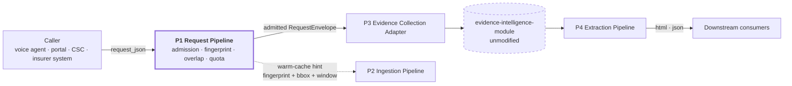
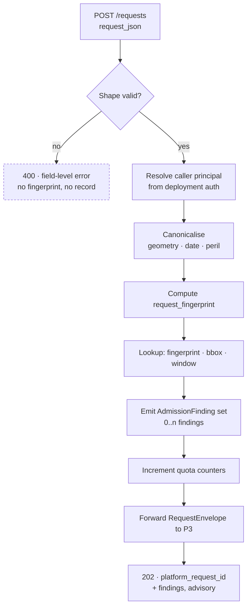
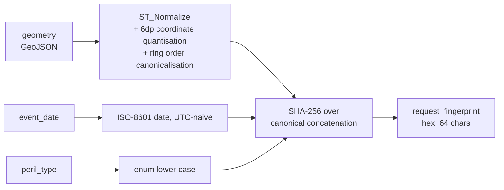
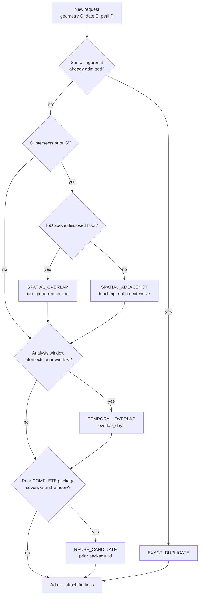
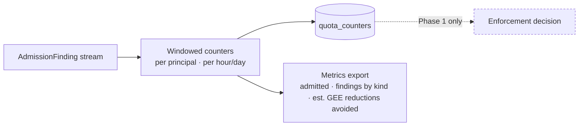
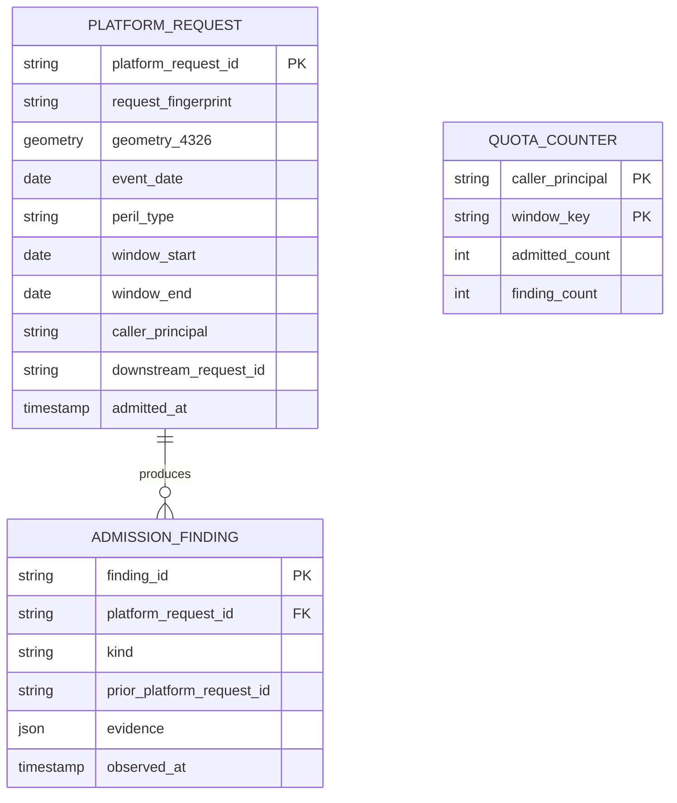

# Request Pipeline (RQP)

*Program 1 of four in the Evidence Collection Platform.*

The Request Pipeline is the platform's single ingress. It receives an evidence
request from a calling system, establishes which system is calling, fingerprints
the request, compares it against everything already admitted, meters it, and
forwards an unmodified four-field body to the Evidence Collection Adapter.

It exists for two reasons. Caller identity has to live somewhere, and it cannot
live in the evidence module. And redundant requests are the dominant avoidable
cost in the platform: one evidence request triggers a 30-day pre-event optical
composite, a 15-day post-event composite, five years of historical composites,
an optional SAR composite, and four weather collections — every one a billed
Earth Engine reduction.

It runs as its own process with its own datastore and its own release train,
and everything it computes is advisory.

## Responsibilities

| In scope | Out of scope |
|---|---|
| Caller principal resolution | Evidence science of any kind |
| Request admission and shape validation | Imagery or weather access |
| Deterministic request fingerprinting | Package content or assembly |
| Duplicate, spatial, and temporal overlap detection | Rendering or downstream delivery |
| Quota accounting and metering | Any figure that appears in a package |

Removability is a structural property rather than an aspiration: with this
program taken out of a deployment, a caller posting directly to the Evidence
Collection Adapter still receives a valid evidence package. Only findings and
metering are lost.

---

## 0. Position in the platform



RQP is the only program in the platform that knows **who** is calling. That
knowledge stops here, by design: `documents/constitution.md` §5 states the
evidence module "does not assume, depend on, or reference any specific
claim-intimation channel" and that no caller is privileged. Anti-abuse
inherently requires caller identity. Putting it downstream would breach §5.
Putting it in a separate front program satisfies both requirements at once.

---

## 1. Why this is a separate program

The evidence module's Constitution §9.2 places "how inputs are produced"
permanently out of its scope, and §9.1 fixes its accepted surface at exactly
four fields — `geometry`, `event_date`, `peril_type`, `external_reference_id`
— and states that it "never widens that surface". Rate limiting needs a caller
principal. Deduplication needs a request history keyed by something other than
`request_id`. Both are fields the module is barred from accepting.

The choice is therefore not "where is it tidier to put anti-abuse". It is:
add anti-abuse to the module and amend its Constitution under §8, or build it
as a program in front. A program in front leaves the module's boundary intact
and costs nothing on the request path that a gateway does not already cost.

The economics reinforce the same split. The per-request acquisition shape in
`ingestion/imagery.py` and `ingestion/weather.py` — pre-event composite,
post-event composite, five historical composites, optional SAR, four weather
collections — is billed per reduction and is identical whether or not the same
question was asked yesterday. Detecting that repetition requires state the
module does not keep and is not permitted to keep.

---

## 2. Phase 0 clauses

Phase 0 posture is fixed: **observe and disclose, never block.** This is not
timidity; it mirrors the discipline the evidence module already enforces on
itself. `has_sufficient_coverage()` returns `True` when no threshold is
configured, with the comment that an unknown figure "is disclosed, not read as
zero coverage". `_phenology_sanity_check()` flags a low pre-event NDVI and
explicitly never blocks. A wrongly-rejected request in this domain means a
farmer with a genuine loss gets no proof. Phase 0 refuses to be the reason
that happens.

| Clause | Statement | Enforcement in Phase 0 |
|---|---|---|
| **RQP-P0-01** | RQP forwards exactly the four module fields and never widens the downstream surface. Everything RQP learns about a caller stays in RQP's own store. | Contract test asserting the outbound body has exactly four keys |
| **RQP-P0-02** | Caller identity terminates at RQP. No principal, tenant, API key, or IP is propagated downstream in any field, header, or log line that Program 3 reads. | Import/serialisation test |
| **RQP-P0-03** | Every request gets a deterministic `request_fingerprint` before admission. | Pure function, golden-vector tested |
| **RQP-P0-04** | Exact-duplicate detection: same fingerprint, already admitted. Recorded, disclosed, **admitted anyway**. | `AdmissionFinding` row + response field |
| **RQP-P0-05** | Spatial-overlap detection: geometry intersecting a prior request's geometry above a disclosed IoU. Recorded, disclosed, admitted. | PostGIS `ST_Intersection` |
| **RQP-P0-06** | Temporal-overlap detection: analysis windows intersecting for an overlapping geometry. Recorded, disclosed, admitted. | Interval arithmetic on derived windows |
| **RQP-P0-07** | Quota accounting is **metered, not enforced**. Counters increment; no request is refused for exceeding one. | Counter store + metric only |
| **RQP-P0-08** | No threshold is invented. Every cut point (IoU floor, quota ceiling, window tolerance) ships unset and inert; a deployment must supply it, and supplying it in Phase 0 changes disclosure only, never admission. | Config test: all thresholds default `None` |
| **RQP-P0-09** | Admission decisions are append-only and replayable. Deleting an `AdmissionFinding` is not a supported operation. | Store has no `DELETE` path |
| **RQP-P0-10** | RQP is optional. A deployment that removes it loses findings and metering, and loses nothing else. | Integration test bypassing RQP |

### 2.1 Why RQP-P0-07 meters instead of enforces

`specs/001-evidence-generation-pipeline/issue/open query - expected request
volume and concurrency target.md` is still open in the module repo. Nobody has
established what normal traffic looks like. A quota ceiling set before that
number exists is a guess, and a guess that rejects requests is a guess that
denies evidence. Phase 0 produces the measurement that closes that issue.
Phase 1 sets the ceiling from the measurement.

---

## 3. Segments

### 3.1 Segment A — Admission



Validation is the **only** rejection path in Phase 0. A malformed polygon is
not an abuse signal; it is a broken caller, and it must fail loudly and
immediately. Everything downstream of `V` admits.

### 3.2 Segment B — Fingerprinting



`external_reference_id` is deliberately **excluded** from the fingerprint. It
is opaque per FR-002 and the module "never validates, interprets, or requires
[it] to match any schema". Two callers submitting the same field, date and
peril under different reference IDs are asking the same question and must
fingerprint identically — that is the whole point.

Coordinate quantisation at 6 decimal places is ~0.11 m at the equator, well
below the 10 m Sentinel-2 pixel the module reduces at. Quantising coarser
would merge genuinely distinct fields; finer would let float noise defeat the
hash.

### 3.3 Segment C — Overlap detection

Four distinct repetition patterns occur in practice, and each gets its own
detector rather than being collapsed into a single "is this a duplicate" test:
the identical request resubmitted; a different caller submitting the same field;
a request whose geometry abuts or partially covers one already analysed; and a
request whose analysis window overlaps a prior one for the same ground.



The analysis window is **derived, not configured**. It is read from the
module's own published constants so the two can never drift:

| Constant | Value | Source |
|---|---|---|
| `PRE_EVENT_WINDOW_DAYS` | 30 | `ingestion/imagery.py:17` |
| `POST_EVENT_WINDOW_DAYS` | 15 | `ingestion/imagery.py:18` |
| `HISTORICAL_BASELINE_YEARS` | 5 | `ingestion/imagery.py:19` |

Analysis window `= [event_date − 30d, event_date + 15d]`. If the module ever
changes those constants, RQP's overlap arithmetic must change with it — so RQP
reads them from the installed package rather than copying the numbers. A
contract test asserts the values it read match the values above; that test
failing is the intended signal that the module moved.

`REUSE_CANDIDATE` is the highest-value finding and the one Phase 0 stops short
of acting on. Serving a cached package instead of a fresh analysis is a
correctness decision about evidence, not a performance decision, and it needs
a written owner. Phase 0 counts how often it *could* have fired.

### 3.4 Segment D — Metering



`est. GEE reductions avoided` is the number that justifies Phase 1. It is
computed from the finding stream against the module's known per-request call
shape, not measured from GEE billing — RQP has no billing access and should
not acquire one.

---

## 4. Wire contract

### `POST /v1/requests`

```json
{
  "geometry": { "type": "Polygon", "coordinates": [] },
  "event_date": "2026-07-07",
  "peril_type": "flood",
  "external_reference_id": "opaque-caller-key"
}
```

### `202 Accepted`

```json
{
  "platform_request_id": "RQP-2026-0707-000118",
  "request_fingerprint": "9f2c…",
  "downstream_request_id": "EIM-2026-0707-000472",
  "status": "ADMITTED",
  "findings": [
    { "kind": "SPATIAL_OVERLAP",  "prior_platform_request_id": "RQP-2026-0705-000091", "iou": 0.87 },
    { "kind": "TEMPORAL_OVERLAP", "prior_platform_request_id": "RQP-2026-0705-000091", "overlap_days": 43 },
    { "kind": "REUSE_CANDIDATE",  "prior_package_id": "PKG-…" }
  ],
  "findings_are_advisory": true
}
```

`findings_are_advisory: true` is a literal in Phase 0 and is asserted by
contract test. When Phase 1 introduces enforcement, that field goes `false`
for enforced deployments — callers that respect it need no other change, and
callers that ignored it get a status they have to handle rather than a silent
behaviour switch.

`400` is unchanged from the module's own shape: `{ "error": "...", "field": "..." }`.

There is **no** `403 Rate Limited` in the Phase 0 contract. Not "returns
rarely" — absent. A caller cannot write handling for a status this program
cannot emit.

---

## 5. Pluggability — the swap test

RQP is pluggable iff all four hold:

1. **Removal test.** Point a caller at Program 3's ingress directly. Full
   evidence package, no error, no missing field. Only findings and metering
   are lost.
2. **Replacement test.** An operator's existing API gateway implements
   `POST /v1/requests` and forwards a conforming envelope. Programs 2–4 cannot
   detect the substitution.
3. **Store isolation.** RQP's tables live in its own schema. It holds no
   foreign key into `evidence_requests` — only the opaque
   `downstream_request_id` string. Dropping RQP's schema does not orphan a row
   in the module's.
4. **Independent release.** RQP can ship a new version without a coordinated
   deploy of 2, 3, or 4, because the only shape it exchanges is the four-field
   body the module already froze.

Point 3 is the one that is easy to get wrong and expensive to unwind. A
foreign key from RQP into the module's schema would make the module's
migrations RQP's problem forever.

---

## 6. Data model owned by RQP



`caller_principal` is the platform's own identifier for the calling system,
minted by RQP. It is not a farmer, not a policy, not a claim. Constitution
§9.1 bars personal-data accumulation; a request already identifies a specific
farm through geometry plus date, so RQP stores geometry because it must
compute overlap on it, and stores nothing else about the person. Retention for
RQP's own tables is a separate decision from the module's 10-year evidence
retention and is listed as open in §9.

---

## 7. Failure posture

| Failure | Phase 0 behaviour |
|---|---|
| Overlap query times out | Admit. Emit `DETECTION_UNAVAILABLE` finding. Never hold a request behind an advisory lookup. |
| RQP store unreachable | Admit and forward. Log the loss. A dedup layer that can take down evidence generation is worse than no dedup layer. |
| Program 3 unreachable | `503` to caller, with the platform request recorded so the finding history stays complete on retry. |
| Fingerprint collision | Treated as a defect, not a duplicate. SHA-256 over canonicalised input; a collision means the canonicaliser is wrong. |

The pattern throughout: **RQP fails open.** It is a cost-control and
observability layer sitting in front of a system whose purpose is to keep
legitimate claims from failing for want of proof. It never becomes the new
reason a claim fails.

---

## 8. Phase 1 and beyond — deferred, each needing a written decision

| Phase | Capability | Decision required first |
|---|---|---|
| 1 | Enforce per-principal quota | The ceiling, from Phase 0 measurement. Closes the module's open volume/concurrency issue. |
| 1 | Serve `REUSE_CANDIDATE` from cache | Who owns "a package generated for an overlapping field 3 days ago is valid evidence for this request"? This is an evidentiary call, not an engineering one. |
| 2 | Geometry clustering / tiling of adjacent requests into one GEE job | Depends on P2 tiling scheme. |
| 2 | Backpressure signalling to callers | Requires P3 queue-depth exposure. |

None of these are started before the clause they relax is amended here in
writing, with the rationale, mirroring the module's own §8 amendment rule.

---

## 9. Open questions

1. **Retention for RQP tables.** The module retains evidence 10 years under
   IRDAI 2020. RQP's tables are operational, not evidentiary. The module's own
   constitution flags the unresolved tension between that 10-year floor and
   DPDP Act 2023 purpose-limitation; RQP inherits the tension and does not
   resolve it here.
2. **Is a finding disclosable to the caller at all?** §4 shows findings in the
   response. Telling caller A that caller B already requested an overlapping
   field leaks information across tenants. Phase 0 ships findings **scoped to
   the requesting principal only**; cross-principal findings are recorded but
   not returned. The wider question — whether a tenant is entitled to know that
   another tenant is analysing adjacent ground — remains open.
3. **IoU floor.** No sourced value. Unset per RQP-P0-08.
4. **Does an overlapping-but-not-identical request warrant a fresh analysis?**
   Physically, yes — the module reduces at 10 m over the exact geometry given.
   Economically, adjacent fields share almost all their imagery. Resolving
   this is the substance of Program 2, not Program 1.
