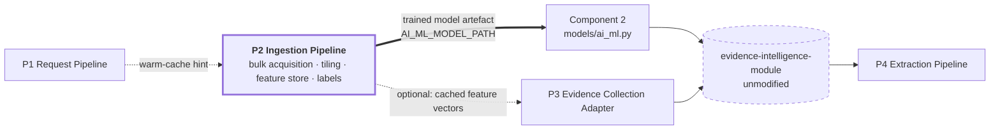
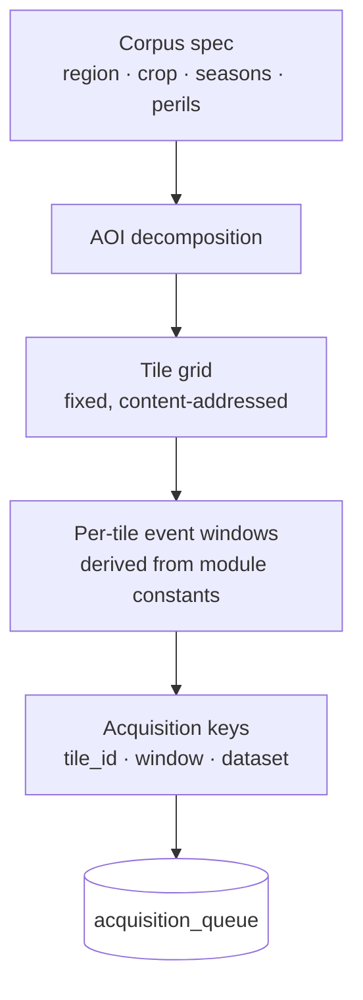
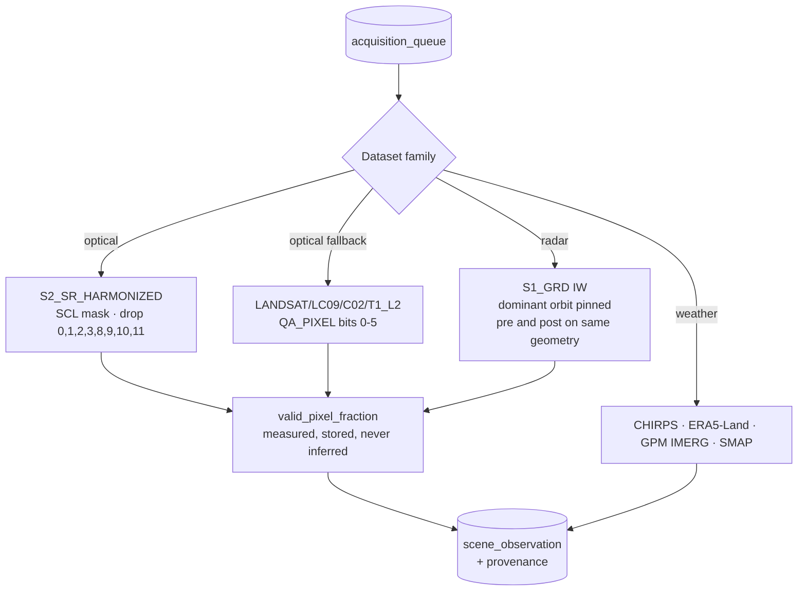
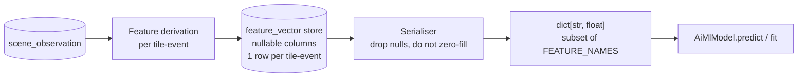
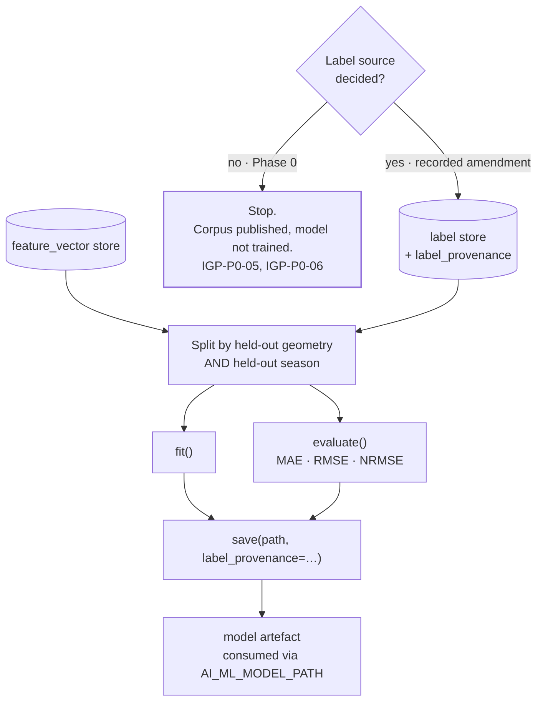
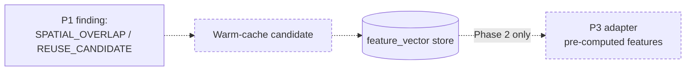
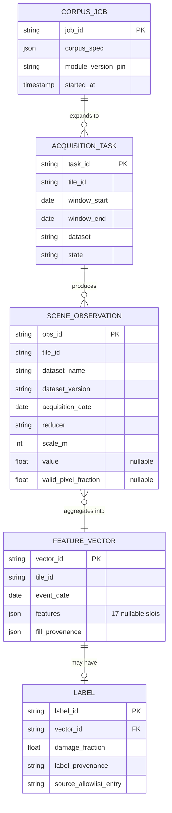

# Ingestion Pipeline (IGP)

*Program 2 of four in the Evidence Collection Platform.*

The Ingestion Pipeline builds and maintains the offline corpus that Component 2
— the AI/ML damage model at `models/ai_ml.py` — requires in order to be trained
at all. It acquires satellite and weather scenes in bulk over a defined region
and season set, derives feature vectors in the model's own fixed feature order,
assembles labels where a permitted label source exists, and publishes a model
artefact the module loads through its existing configuration.

Component 2 is one of five model families the evidence module runs, and it is
the only one that needs a *corpus* rather than a formula. Semi-physical, CSM,
DSI and causation all compute from a single request's own observations. The
AI/ML model needs many fields, many events, many seasons, and labels — and the
module has no supplier for any of that, by design.

It runs offline, off the request path, with its own object store, feature store
and release train.

## Responsibilities

| In scope | Out of scope |
|---|---|
| Bulk scene acquisition and tiling | Per-request ingestion (`ingestion/imagery.py`, `ingestion/weather.py`) |
| The offline feature store and its provenance | The model implementation itself (`models/ai_ml.py`) |
| Label assembly against a permitted source | Any evidence package |
| Train/eval splitting and accuracy reporting | Any threshold, weight, or coefficient used as science |
| Publishing a loadable model artefact | Any write path into the module other than that artefact |

Removability is structural: with this program absent, Component 2 returns to
the untrained placeholder path it ships with today. That is a disclosed state
of the module, not a failure of it.

---

## 0. Position in the platform

The thick arrow is the reason this program exists. Everything else IGP does is
in service of it.

---

## 1. Why this is a separate program

The module's own status is unambiguous on the gap:

> "The AI/ML damage model ships **untrained** by default" — `README.md`
> "no sourced training data exists" — open issue *AI-ML training data source and CCE-label question*

The behaviour when untrained is equally explicit. `models/ai_ml.py` falls
through to `_placeholder_estimate()`, which averages the features it was
actually given. The code comment on that function records why it was written
that way: averaging over all 17 `FEATURE_NAMES` instead of the supplied subset
"divided every estimate by" the missing count — the same defect class
catalogued in `pipeline-decomposition-design.md` §1, where an unmeasured input
silently became a measured `0.0`.

Constitution §9.2 puts the supply chain that would close that gap permanently
outside the module:

> "The module owns the transformation, not the supply chain at either end.
> Labeled data arrives; an evidence package leaves."

IGP is the mechanism by which labelled data arrives. It is not a workaround
for a boundary; it is the program that boundary presupposes.

### 1.1 What IGP is not

It is not a replacement for `ingestion/imagery.py`. That module does per-request,
synchronous, request-scoped acquisition and it works. IGP is offline, bulk,
and corpus-scoped. Two different jobs that happen to call the same Earth
Engine.

Both directions of confusion are expensive:

| Confusion | Consequence |
|---|---|
| IGP re-implements per-request ingestion | Two code paths compute NDVI differently; packages stop being re-derivable; Constitution §2.1 breaks |
| The module absorbs IGP's bulk jobs | The module acquires a scheduler and a corpus, breaching §9.2 and §3's no-proactive-scanning boundary |

---

## 2. Phase 0 clauses

| Clause | Statement | Enforcement in Phase 0 |
|---|---|---|
| **IGP-P0-01** | IGP writes exactly one artefact the module consumes: a model file loadable by `AiMlModel.load()`. No other write path into the module exists. | Import-graph test; module has no IGP dependency |
| **IGP-P0-02** | IGP produces feature vectors in `FEATURE_NAMES` order, read from the installed module, never copied. A mismatch is a build failure, not a runtime surprise. | `AiMlModel.load()` already rejects a foreign feature order — IGP asserts the same list at build time |
| **IGP-P0-03** | Absence is represented as absence. A feature that was not measured is `None` in the store and is **omitted** from the vector passed to `predict()`, never zero-filled. | Feature-store schema is nullable; serialiser drops `None`, does not default |
| **IGP-P0-04** | Every stored feature carries provenance: dataset name, dataset version, acquisition date, reducer, scale. | Non-nullable provenance columns |
| **IGP-P0-05** | Phase 0 produces **no labels from CCE data of any kind**. The module's Constitution §4 excludes CCE; a corpus built on CCE labels would launder that exclusion. | Label-source allowlist, empty of CCE sources |
| **IGP-P0-06** | Phase 0 ships **no trained model**. It ships the corpus, the pipeline, and the accuracy harness. Training runs only once a label source is decided and recorded. | `AI_ML_MODEL_PATH` stays unset by default |
| **IGP-P0-07** | Train/eval separation is structural. `AiMlModel.fit()` already documents that fit rows "must NOT include any rows also passed to" evaluate; IGP enforces the split by held-out geometry **and** held-out season, not random row split. | Split function + leakage test |
| **IGP-P0-08** | No threshold, weight, or coefficient is invented. IGP contributes data; it does not contribute science. Any new cut point requires the same sourced-or-disclosed treatment the module applies. | Review clause |
| **IGP-P0-09** | Bulk acquisition is bounded and idempotent. A re-run over the same tile-time key produces the same rows and does not re-bill. | Content-addressed tile keys |
| **IGP-P0-10** | IGP is optional. Removing it returns Component 2 to its shipped placeholder behaviour, which is a disclosed state, not a failure. | Integration test with IGP absent |

### 2.1 IGP-P0-05 in detail

Historical CCE outcomes are the only large labelled yield-loss dataset in the
Indian crop-insurance system, and the module's own open issue names the
temptation directly: *"whether historical CCE outcomes may be used as offline
training labels"*.

Phase 0 leaves the question open rather than proceeding as though it were
settled. The module's Constitution §4 says it "does not ingest, validate, or dispute CCE
plot data", and §8 says that boundary can only move by explicit recorded
amendment. Training Component 2 on CCE labels would mean every package the
module emits is partly derived from CCE — while the package text asserts it is
not. That is a §65B admissibility problem, not a data-science preference.

IGP-P0-05 therefore holds the boundary at the schema level and leaves the
amendment to the party empowered to make it under §8.

---

## 3. Segments

### 3.1 Segment A — Corpus definition

Windows are derived from the module's published constants, identically to
Program 1:

| Constant | Value | Source |
|---|---|---|
| `PRE_EVENT_WINDOW_DAYS` | 30 | `ingestion/imagery.py:17` |
| `POST_EVENT_WINDOW_DAYS` | 15 | `ingestion/imagery.py:18` |
| `HISTORICAL_BASELINE_YEARS` | 5 | `ingestion/imagery.py:19` |

A corpus built on different windows than the module analyses would train
Component 2 on a distribution it never sees in production. This is the single
most likely way to build a model that scores well offline and is wrong in
every package.

### 3.2 Segment B — Acquisition

Every masking rule above is the module's, read off `ingestion/gee_client.py`
(`_sentinel2_valid_mask`, `_landsat_valid_mask`, `_dominant_orbit`,
`_valid_pixel_fraction`) and `ingestion/weather.py` (`CHIRPS_DAILY`,
`ERA5_LAND_DAILY`, `GPM_IMERG`, `SMAP_L3`). IGP does not restate them as its
own policy — it **calls the module's client code as a library** wherever the
computation is identical, so the corpus and the packages cannot diverge.

This is the deliberate design decision of this program: *reuse the module's
computation, do not re-implement it.* Reading is allowed; a library dependency
from IGP → module is fine and does not breach any boundary. A dependency in
the other direction is what §9.2 forbids, and IGP-P0-01 keeps that direction
empty.

### 3.3 Segment C — Feature assembly for Component 2

The 17 features are fixed by the module and are not IGP's to change:

| Group | Features |
|---|---|
| Optical indices | `ndvi_deviation`, `evi_deviation`, `red_edge_index`, `ndwi_deviation`, `lswi_deviation` |
| Radar | `vh_vv_backscatter_deviation`, `rvi` |
| Rainfall | `rainfall_anomaly`, `rainy_day_count`, `dry_spell_length`, `wet_spell_length` |
| Thermal | `temperature_anomaly`, `growing_degree_days`, `heat_cold_wave_flag` |
| Canopy / soil | `fapar_deviation`, `lai_deviation`, `soil_moisture_deviation` |

`pipeline-decomposition-design.md` records defect `T0-04`: **11 of the 17 were
never supplied**, and each absent one became `0.0`, "every estimate diluted
toward zero". IGP's coverage target is therefore stated as a measurement, not
an aspiration — Phase 0 reports per-feature fill rate across the corpus, and a
feature IGP cannot source stays `None` and stays visibly `None`.

Those 11 columns are the substance of this program: it is the supplier for the
features that currently have none, and the per-feature fill rate is the metric
against which a corpus is judged fit to train on.

### 3.4 Segment D — Labels and training

`AiMlModel.save()` already requires `label_provenance` as a keyword argument.
That is not decoration — the module refuses to persist a model without
recording what it was trained on, because `modeling-approach.md` §3 and
YES-TECH §2.3 both require disclosed accuracy and disclosed provenance in the
package. IGP treats that argument as the contract it must satisfy before it is
allowed to produce an artefact at all.

The split is by geometry **and** season, not random rows. Random splitting on
a corpus of overlapping tiles across adjacent seasons leaks: the same field in
the same year appears on both sides, and reported MAE becomes fiction. The
module's package prints that MAE.

### 3.5 Segment E — Optional warm cache (deferred)

Everything on this diagram is dashed. Serving a request from cached features
changes what a package is derived from, and the package asserts its own
derivation under §65B. It stays a Phase 2 item with a named owner.

---

## 4. Wire and artefact contracts

IGP exposes an operator API, not a request-path API. It is off the hot path
entirely.

| Interface | Shape | Consumer |
|---|---|---|
| `POST /v1/corpus-jobs` | corpus spec → job id | Operator |
| `GET /v1/corpus-jobs/{id}` | progress, per-feature fill rate, cost | Operator |
| `GET /v1/feature-vectors?tile&window` | vectors + provenance | P3 (Phase 2 only) |
| model artefact | file at `AI_ML_MODEL_PATH` | Component 2, via existing config |

The last row is the whole integration. `config.py` already reads
`AI_ML_MODEL_PATH` from the environment and `AiMlModel.load()` already
validates the feature order and rejects a mismatch. **Adopting IGP requires no
change to the module** — no new endpoint, no schema migration, no code edit.
The integration surface is one file path and one already-enforced validation.

---

## 5. Pluggability — the swap test

1. **Removal test.** Unset `AI_ML_MODEL_PATH`. Component 2 returns to
   `_placeholder_estimate()`. The module still emits packages; the ensemble
   still runs its other four components. This is the module's shipped
   behaviour today, so the test passes by construction.
2. **Replacement test.** Any process that writes a file `AiMlModel.load()`
   accepts is a valid IGP. IGP owns no privileged channel.
3. **Direction test.** `grep` the module for any IGP symbol. Zero hits, now
   and permanently. IGP-P0-01.
4. **Independent release.** IGP ships corpus versions on its own cadence; the
   module pins a model artefact by path and hash.

The asymmetry is intentional and worth stating plainly: **IGP depends on the
module; the module never depends on IGP.** That is what makes it pluggable
rather than entangled.

---

## 6. Data model owned by IGP

`LABEL.source_allowlist_entry` is non-nullable and validated against an
allowlist that is **empty in Phase 0**. A row cannot be written without naming
an approved source, and no source is approved yet. IGP-P0-05 is enforced by
the schema, not by discipline.

---

## 7. Failure posture

| Failure | Behaviour |
|---|---|
| GEE quota exhausted mid-job | Job pauses, resumes from the last content-addressed key. No partial vector is written. |
| A feature has no source at all | Stays `None` for the whole corpus, reported in fill rate. Never imputed. IGP-P0-03. |
| Fill rate too low to train | Job completes, model is not produced, `AI_ML_MODEL_PATH` stays unset. A weak model is worse than the disclosed placeholder. |
| `FEATURE_NAMES` changed in the module | Build fails at IGP-P0-02 assertion. Corpus is rebuilt or explicitly re-pinned. |
| Leakage test fails | Artefact is not written. `save()` is never reached. |

The theme: IGP fails **closed**, the mirror image of Program 1. RQP must never
prevent evidence from being generated, so it fails open. IGP must never inject
an unjustified model into evidence, so it refuses to produce anything it
cannot justify.

---

## 8. Phase 1 and beyond

| Phase | Capability | Decision required first |
|---|---|---|
| 0 → 1 | Train Component 2 | The label source, recorded as an amendment against Constitution §4. Closes the module's open training-data issue. |
| 1 | Publish per-crop harvest index | The module's open *harvest index source and per-crop resolution* issue. |
| 1 | Fill the remaining `None` features | Per-feature source decision; some may have no public source at any usable resolution. |
| 2 | Warm-cache feature serving to P3 | Evidentiary owner for cached-derivation packages. |
| 2 | Non-GEE sources — ISRO archives, hyperspectral | Each is a licensing and provenance decision before it is an engineering one. |

---

## 9. Open questions

1. **The label source.** Until it is decided, IGP produces a corpus against an
   empty allowlist and no model. Every other capability described above is
   downstream of that single decision.
2. **Tile grid vs. field polygons.** A corpus tiled on a fixed grid is cheap
   and reusable; the module analyses arbitrary field polygons. Aggregation
   error between the two is unmeasured and would need to be characterised
   before training on tile-derived features.
3. **ISRO archives and hyperspectral sources.** Adding either changes what
   "independently verifiable" means in a package (Constitution §2.5) and
   warrants the same scrutiny as any GEE dataset, including a licensing review
   that has not been done.
4. **Does a trained Component 2 change the module's methodology version?**
   Per `pipeline-decomposition-design.md` §2.1, versions stay per-component
   precisely so retraining Component 2 does not invalidate the physics model's
   version. IGP must therefore bump `ai-ml-rf-v1` on every artefact it
   publishes, and no mechanism for that bump currently exists.
