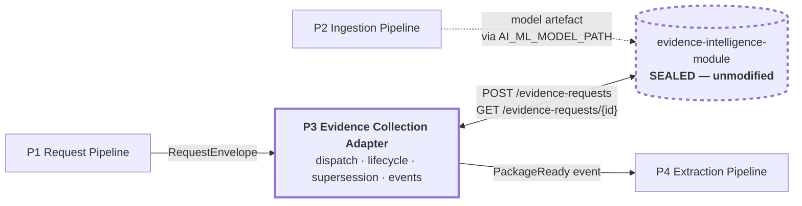
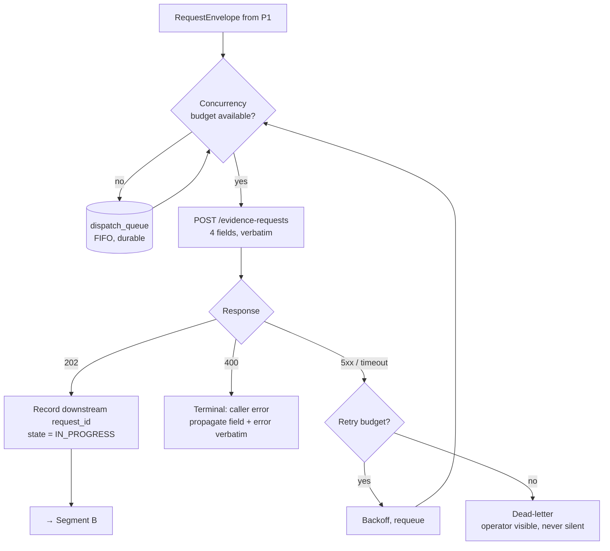
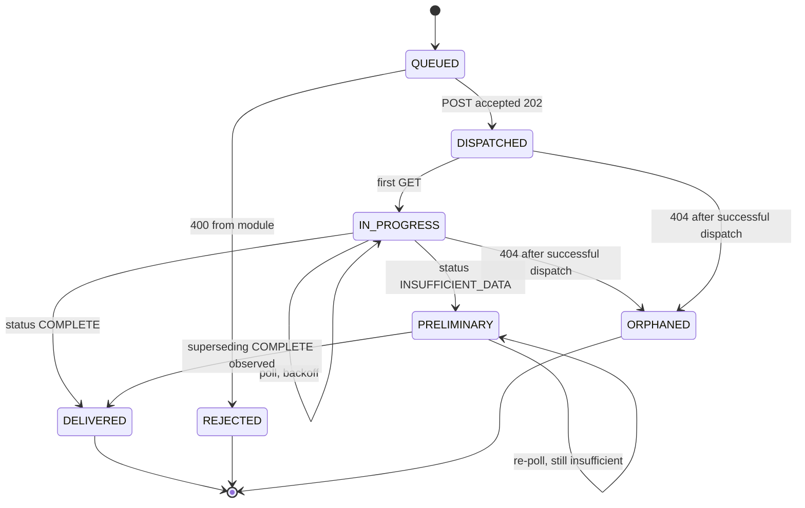
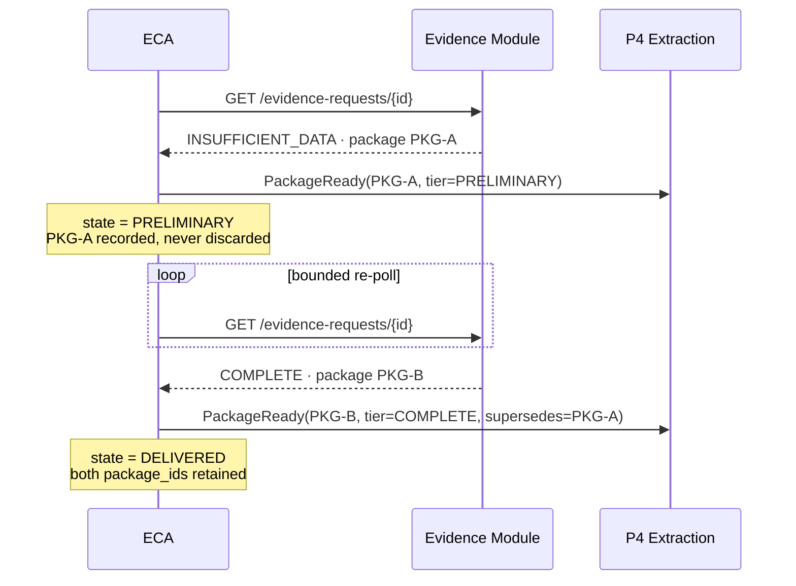
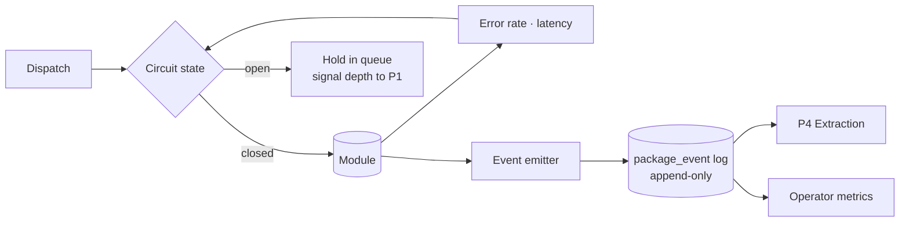
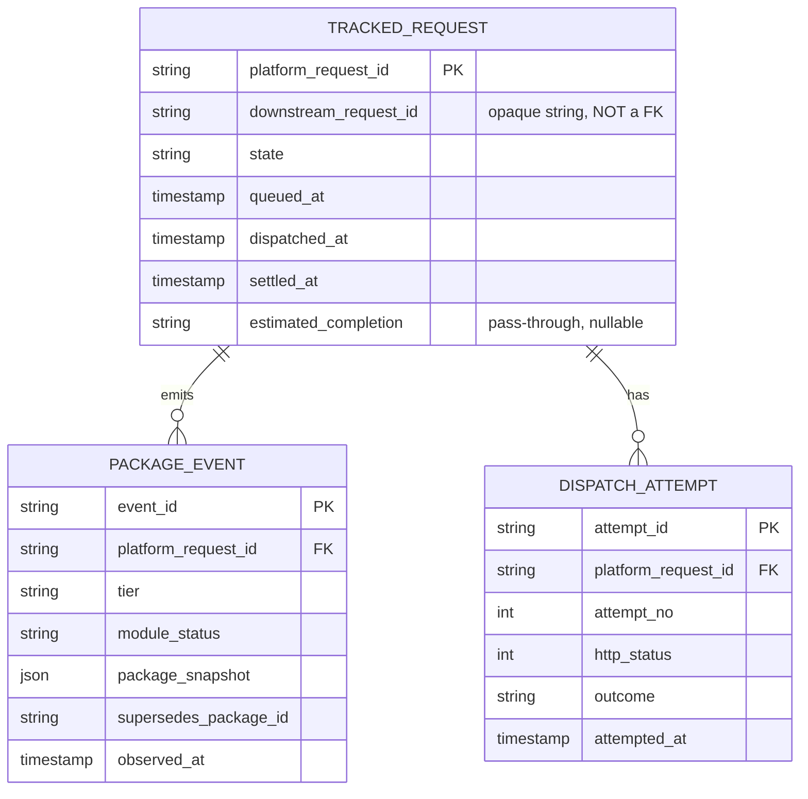

# Evidence Collection Adapter (ECA)

*Program 3 of four in the Evidence Collection Platform.*

The Evidence Collection Adapter owns the platform-side lifecycle of an evidence
request. It dispatches requests to the evidence module, polls them to
settlement, tracks the supersession of preliminary packages by complete ones,
applies backpressure when the module saturates, and converts a poll-based
contract into an event stream the rest of the platform can consume.

It treats the evidence module as a **sealed dependency**. It reads the module's
published HTTP contract and its published constants, and nothing else. It does
not fork the module, patch it, subclass into it, or hold a credential for its
database. Every platform concern that would otherwise accumulate inside the
module — retry, eventing, queueing, lifecycle state — terminates here instead.

It runs as its own process in front of the module's FastAPI service.

## Responsibilities

| In scope | Out of scope |
|---|---|
| Dispatch, retry, and dead-lettering | Any file inside `evidence-intelligence-module/` |
| Poll scheduling and backoff | Any evidence figure or model output |
| Lifecycle state per request | The module's data model or its migrations |
| Supersession tracking across package tiers | Interpretation of `external_reference_id` |
| Backpressure and concurrency budget | Completion estimates, which are passed through |
| The outbound `PackageReady` event stream | Package rendering or delivery |

Removability is structural: with this program absent, a caller can post
directly to the module and a consumer can poll it directly — a pattern its own
contract explicitly supports. Lost are events, retry, supersession tracking,
and backpressure.

---

## 0. Position in the platform



This is the shortest program in the platform and the one with the strictest
rule. Its entire job is to be the place where platform concerns live so that
they do not migrate into the module.

---

## 1. Why this is a separate program

The evidence module is finished, working software: 42 implementation tasks
complete, 55/55 tests passing, Postgres and PostGIS verified against a live
database, with a constitution of permanent boundaries and a §8 amendment
procedure governing any change to them. It is a dependency to be integrated,
not a codebase to be extended.

A platform assembled from four programs nonetheless needs capabilities the
module deliberately does not provide:

| Platform need | Why the module does not provide it | Where it goes |
|---|---|---|
| Know when a package becomes ready | Contract is poll-based; "webhook, if a deployment adds one" is explicitly a deployment concern | ECA |
| Push events to Program 4 | Module never initiates anything (Constitution §3, FR-027) | ECA |
| Backpressure when GEE is saturated | Module's concurrency target is an open issue | ECA |
| Track that a preliminary package was superseded | Module retains both; nothing watches the transition | ECA |
| Retry a transient failure | Not in the contract | ECA |

Each row describes a capability that, if added to the module, would either
breach one of its boundaries or require a §8 amendment. The adapter is where
they go instead.

### 1.1 The failure mode this prevents

The ordinary way an integration like this decays: six months in, someone needs
a field the module does not return, adds a column to `evidence_packages`, and
the module stops being a sealed dependency. From that point the platform cannot
upgrade it, its migrations become breaking changes for programs it has never
heard of, and the boundaries in its constitution describe a system that no
longer exists.

ECA-P0-02 is the clause that prevents this, and it is the load-bearing
constraint of the entire adapter.

---

## 2. Phase 0 clauses

| Clause | Statement | Enforcement in Phase 0 |
|---|---|---|
| **ECA-P0-01** | ECA communicates with the module **only** through `POST /evidence-requests` and `GET /evidence-requests/{request_id}`. No other surface. | Network policy + contract test |
| **ECA-P0-02** | ECA has **no database credential** for the module's Postgres. Not read-only, not reporting, none. | Deployment: no credential is issued |
| **ECA-P0-03** | No file inside `evidence-intelligence-module/` is added, edited, or deleted in the course of building or operating the platform. | CI check on the vendored SHA |
| **ECA-P0-04** | ECA adds no field to the request body and drops no field from it. The four-field contract passes through unchanged. | Contract test on both directions |
| **ECA-P0-05** | ECA never interprets `external_reference_id`. It is opaque here exactly as it is opaque in the module (FR-002). | Type is `str`, never parsed |
| **ECA-P0-06** | All four module statuses are handled as first-class outcomes: `IN_PROGRESS`, `COMPLETE`, `INSUFFICIENT_DATA`, and `404`. `INSUFFICIENT_DATA` is a **delivery**, not an error. | State-machine test |
| **ECA-P0-07** | Supersession is tracked, never destructive. When a `COMPLETE` package replaces a preliminary one, ECA records both `package_id`s and emits both events. It deletes nothing. | Append-only event log |
| **ECA-P0-08** | Polling is bounded and never becomes a load source. Backoff schedule is disclosed and configurable; ECA holds no open request against the module. | Backoff config + concurrency cap |
| **ECA-P0-09** | ECA invents no completion estimate. `estimated_completion` is passed through from the module verbatim or omitted. | Pass-through test |
| **ECA-P0-10** | ECA is removable. A caller may POST the module directly and a consumer may poll it directly; the platform simply loses events, retry, and supersession tracking. | Integration test bypassing ECA |

### 2.1 Why ECA-P0-02 is absolute

A read-only credential seems harmless and is not. The module's data model is
its own — `documents/constitution.md` §5: "This module owns its own data model
(Section 4 of `hld.md`). It does not read from or write to another
initiative's tables". The inverse obligation is not written down there because
the module cannot write obligations for its consumers, so it is written down
here.

The moment Program 3 or Program 4 SELECTs from `evidence_packages`, the
module's schema becomes a public interface, its migrations become breaking
changes, and `pipeline-decomposition-design.md`'s constraint 2 — "the store
schema does not change" — flips from a design choice the module made for its
own good reasons into a compatibility shackle imposed from outside.

Everything the platform needs is already in the `GET` response. If something
genuinely is not, the correct move is a contract amendment in the module's
repo under its own §8 process — not a SELECT.

---

## 3. Segments

### 3.1 Segment A — Dispatch



The concurrency budget is ECA's, not the module's. The module's own expected
volume and concurrency target is an open issue in its repo; until that closes,
ECA holds a conservative configured cap and **reports queue depth**, which is
the measurement that closes the issue.

A `400` is terminal and is propagated with the module's own `{ "error",
"field" }` body unchanged. ECA does not rewrite it into a platform error
vocabulary — a caller debugging a malformed polygon needs the module's words.

### 3.2 Segment B — Lifecycle



`PRELIMINARY` is a **terminal-capable** state, not a failure state. The module
delivers a weather-only package rather than failing when imagery is
unavailable, and "the request stays open until a complete package can be
generated". A consumer may legitimately act on the preliminary package and
never receive a superseding one. ECA models that as success.

`ORPHANED` — a `404` for a `request_id` the module itself issued — is an
integrity violation, not a normal outcome. It surfaces to an operator
immediately and is never retried into existence.

### 3.3 Segment C — Supersession



The module's contract is explicit that the preliminary package "remains
independently retrievable by its own `package_id` for audit purposes" after
supersession. ECA's event log must preserve that property downstream: Program
4 receives two `PackageReady` events, not one corrected one. An audit that can
see only the final package cannot show what was relied on in the interval.

`supersedes` is a link, never a delete instruction. ECA-P0-07.

### 3.4 Segment D — Backpressure and the outbound stream



ECA is the only program that can observe module saturation, because it is the
only one that talks to it. The queue-depth signal it exposes back to Program 1
is the substrate for Program 1's Phase 1 backpressure work — which is why that
item is listed as deferred there and originated here.

---

## 4. Wire contract

### Inbound — from Program 1

```json
{
  "platform_request_id": "RQP-2026-0707-000118",
  "payload": {
    "geometry": { "type": "Polygon", "coordinates": [] },
    "event_date": "2026-07-07",
    "peril_type": "flood",
    "external_reference_id": "opaque-caller-key"
  }
}
```

`payload` is passed to the module **byte-for-byte**. It is not re-serialised
from a platform type, because a round-trip through a platform model is exactly
how a field quietly gets normalised, dropped, or added. ECA-P0-04.

### Outbound — `PackageReady` to Program 4

```json
{
  "event_id": "EVT-…",
  "platform_request_id": "RQP-2026-0707-000118",
  "downstream_request_id": "EIM-2026-0707-000472",
  "tier": "PRELIMINARY",
  "status": "INSUFFICIENT_DATA",
  "package": {
    "pdf_uri": "…",
    "json_uri": "…",
    "map_uris": [],
    "methodology_version": "v1.2.0",
    "note": "…"
  },
  "supersedes_package_id": null,
  "observed_at": "2026-07-07T18:04:11+05:30"
}
```

`package` is the module's own object, unmodified and unflattened. ECA adds
envelope fields around it and never inside it. A consumer that already knows
the module's package shape needs no translation table.

---

## 5. Pluggability — the swap test

1. **Removal test.** Program 1 POSTs the module directly; Program 4 polls it
   directly. Both work — the module's contract explicitly supports polling.
   Lost: events, retry, supersession tracking, backpressure.
2. **Replacement test.** Any process implementing the inbound envelope and
   emitting `PackageReady` is a valid ECA. A queue-based implementation and an
   HTTP one are both conformant.
3. **Seal test.** `git diff` against the vendored module SHA is empty. Run in
   CI on every build, this converts the sealed-dependency rule from a
   convention into a mechanical check that cannot be quietly skipped.
4. **Credential test.** No module database credential exists in ECA's
   environment or secret store.

---

## 6. Data model owned by ECA



`downstream_request_id` is typed as an opaque string and carries no foreign
key — the same discipline Program 1 applies. `package_snapshot` stores the
module's package object as received; it is a record of what ECA observed at a
point in time, not a second source of truth about what the package is. The
module's store remains authoritative.

---

## 7. Failure posture

| Failure | Behaviour |
|---|---|
| Module returns `5xx` | Bounded retry with backoff, then dead-letter. Never silent. |
| Module slow / queue deep | Circuit opens, requests hold in ECA's queue, depth reported. Nothing is dropped. |
| Module returns `404` for a dispatched id | `ORPHANED`. Operator alert. No retry. |
| Duplicate `PackageReady` emitted | Consumers dedupe on `event_id`; emission is at-least-once by design, because losing a package event is worse than delivering one twice. |
| Module contract changes shape | Contract tests fail in CI against the pinned SHA before deploy. |
| ECA's own store unreachable | Stop dispatching. Unlike Program 1, ECA fails **closed** — dispatching without being able to record the dispatch produces requests nobody is tracking. |

---

## 8. Phase 1 and beyond

| Phase | Capability | Decision required first |
|---|---|---|
| 1 | Webhook subscription instead of polling | The module's contract permits a deployment-added webhook. Adding one is a change to the module's repo under its §8 process — not something ECA can do unilaterally. |
| 1 | Publish queue-depth signal to P1 | Program 1's Phase 1 backpressure item. |
| 1 | Priority classes on the dispatch queue | Requires a policy on which requests wait. Evidentiary implications; needs an owner. |
| 2 | Multi-instance module fan-out | Requires the module's concurrency target to be closed. |

---

## 9. Open questions

1. **When does re-polling a `PRELIMINARY` stop?** The module keeps the request
   open indefinitely — imagery may become available weeks later. The adapter
   cannot poll forever. The stopping rule is an evidentiary question (how long
   does a claim remain open?) with no engineering answer; Phase 0 applies a
   configured, disclosed bound in the absence of one.
2. **At-least-once vs. exactly-once events.** Phase 0 delivers at-least-once
   and places dedupe responsibility on the consumer. Worth revisiting only if a
   consumer emerges for which duplicate delivery is materially harmful.
3. **Is `package_snapshot` subject to a retention obligation?** The module
   retains packages 10 years under IRDAI 2020. The adapter's snapshot is a
   copy. If that copy is itself evidence, the adapter inherits a 10-year
   obligation together with the DPDP purpose-limitation tension the module's
   constitution already records as unresolved. This is the largest unanswered
   question in the adapter's design.
