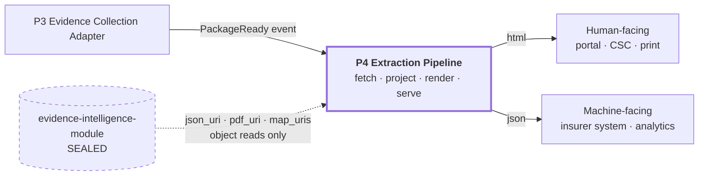
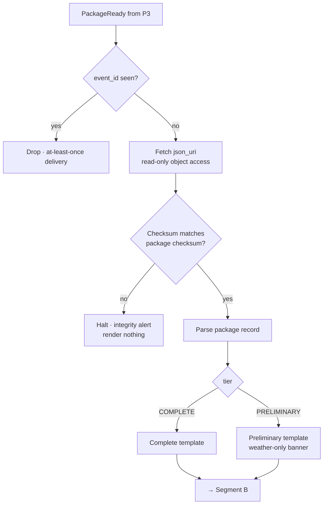
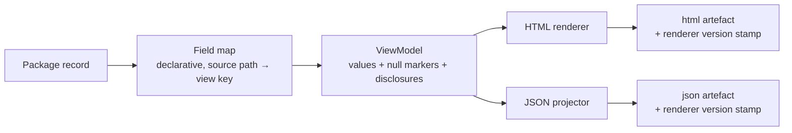
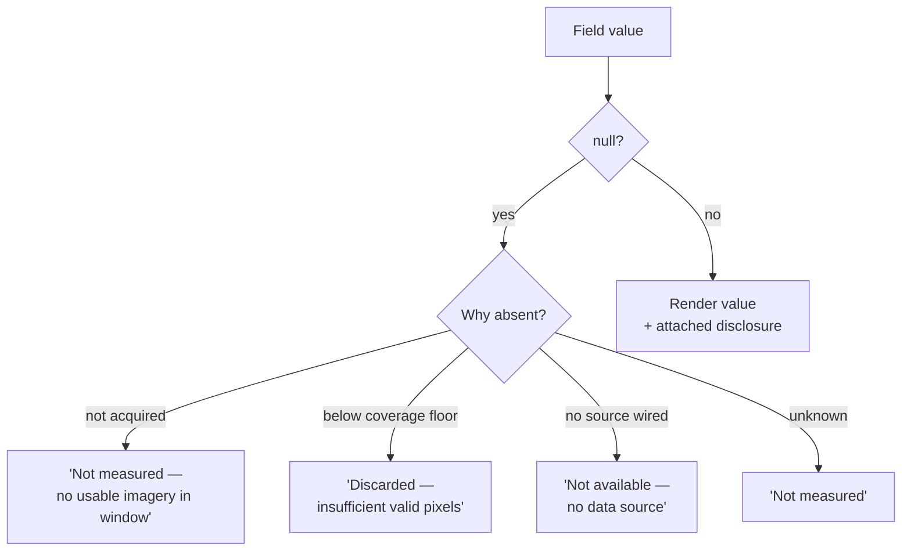
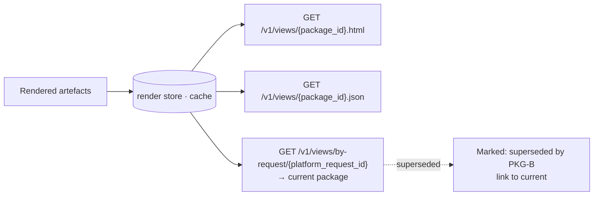
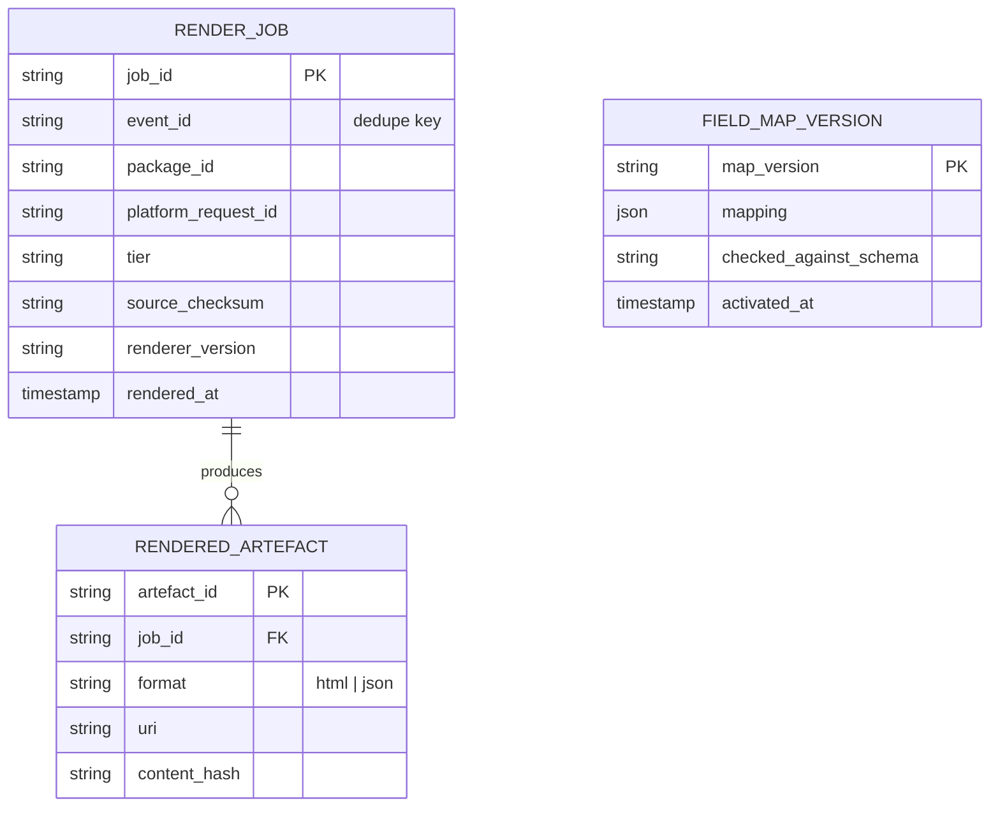

# Extraction Pipeline (EXP)

*Program 4 of four in the Evidence Collection Platform.*

The Extraction Pipeline projects a finished evidence package into the shapes
downstream systems consume — an HTML view for people and a JSON projection for
machines — along with the metric views those systems read.

It is **read-only and derivation-free**. Every value it emits maps to exactly
one field in the module's package JSON. It computes no sums, no ratios, no
reclassifications, and no unit conversions, because a figure the renderer
invented traces back to the renderer rather than to a named, dated satellite or
weather source — which is precisely what Constitution §2.5 requires an auditor
be able to do for any figure in a report.

It runs as its own process with its own render store and release train, and
holds no authoritative state: every artefact it serves is reconstructible from
the package alone.

## Responsibilities

| In scope | Out of scope |
|---|---|
| Package fetch and checksum verification | Any computed or derived figure |
| Declarative field mapping to view models | The module's store, schema, or credentials |
| HTML and JSON rendering | Composite indices — those belong to Component 5 |
| Null and disclosure presentation | Aggregate or portfolio views |
| Stable per-package and per-request routes | Adjudication, indemnity, or settlement logic |

Removability is structural: a consumer can fetch `json_uri` and `pdf_uri`
directly from the URIs the module's own `GET` already returns. This program is
a convenience layer, never a dependency for correctness.

---

## 0. Position in the platform



The dotted edge is the only path by which this program touches the module: it
reads the object URIs the module already published, and holds no other access.

---

## 1. Why this is a separate program

The module already produces a PDF and a JSON record — `packaging/report_generator.py`
builds both, checksums them, and stores them. The question a fourth program has
to answer is why that is not sufficient.

It is not sufficient because the module's outputs are **evidentiary artefacts**
and downstream systems need **operational views**. They are different products
with different lifecycles:

| Module output | EXP output |
|---|---|
| §65B-compliant PDF, checksummed, retained 10 years | HTML view, regenerable, disposable |
| Complete JSON record with full provenance | Filtered JSON projections, per consumer |
| One shape, for every caller equally | Many shapes, one per integration |
| Changing it changes what evidence *is* | Changing it changes only presentation |

Constitution §9.3 puts downstream consumption permanently outside the module,
for the same reason §9.2 puts upstream production outside it: the module owns
the transformation, not either end of the supply chain. A per-insurer JSON
shape inside the module would make one caller privileged, breaching §5.

Constitution §9.3 goes further and enumerates the downstream exclusions by
name — among them "Farmer- or surveyor-facing UI", "Dashboards, BI, portfolio
analytics", and "Delivery and notification", with the note that "the package is
retrieved from a URI" and a callback is "a readiness notification, not
delivery". Every one of those is a thing a real deployment needs and the
module will never supply. EXP is where they land.

There is a second, blunter reason. The module's PDF is a fixed ReportLab
document in `_build_pdf()` — one layout, checksummed, built to be admissible.
That is exactly right for an evidentiary artefact and exactly wrong as a place
to put a stakeholder's requested chart. EXP absorbs every "can we also show…"
request that would otherwise land there and start bending that layout.

---

## 2. Phase 0 clauses

| Clause | Statement | Enforcement in Phase 0 |
|---|---|---|
| **EXP-P0-01** | **Derivation-free.** Every value rendered maps 1:1 to a field in the package JSON. No sums, no ratios, no reclassification, no unit conversion. | Field-mapping table; test asserting every rendered key has a source path |
| **EXP-P0-02** | EXP has no database credential for the module's store, and reads packages only via the URIs in the `PackageReady` event. | Deployment: no credential issued |
| **EXP-P0-03** | Mandatory §65B fields are non-suppressible in every artefact: source attribution, methodology version, accuracy statement, chain of custody. A view that omits one is invalid, not merely terse. | Renderer refuses to emit without them |
| **EXP-P0-04** | Absence renders as absence. A `null` in the package renders as "not measured", never as `0`, `—`, blank, or an omitted row. | Golden-render test per nullable field |
| **EXP-P0-05** | Disclosures travel with the figures they qualify. `valid_pixel_fraction`, the phenology flag, the coverage statement, and the preliminary-tier note render adjacent to the values they constrain, not in a footer. | Layout test |
| **EXP-P0-06** | Preliminary and complete packages are visually and structurally distinguishable at a glance. A weather-only package must never be mistakable for a full one. | Distinct template; tier is a required render input |
| **EXP-P0-07** | Superseded packages remain renderable at their own stable URL, marked superseded. Nothing is retracted. | Both `package_id`s route |
| **EXP-P0-08** | Renders are reproducible: same package + same renderer version ⇒ byte-identical output. Renderer version is stamped in the artefact. | Hash test in CI |
| **EXP-P0-09** | EXP holds no authoritative state. Every render is reconstructible from the package alone; the render store is a cache. | Cache-wipe recovery test |
| **EXP-P0-10** | EXP is removable. A consumer can fetch `json_uri` / `pdf_uri` directly and lose only convenience. | Integration test bypassing EXP |

### 2.1 EXP-P0-01 in detail

"Extraction" is a misleading name for what this program does, and the
misreading is the risk. It suggests a place where metrics get *computed*, and
a component understood that way accretes a rollup, then a derived index, then a
number that appears in a report and exists nowhere in the evidence.

At that point the package stops being independently verifiable. Constitution
§2.5 requires that "an insurer, auditor, or court must be able to trace any
figure in a report back to a named, dated, publicly identifiable
satellite/weather data source." A figure EXP invented traces to EXP.

The module already has a designated place for composite figures: Component 5,
the Damage Severity Index, entropy-weighted and versioned as `dsi-entropy-v1`.
If a new composite is needed, it belongs there, under the module's own §8
process — not in the renderer.

EXP-P0-01 is what makes "extraction" mean *projection*, not *calculation*.

---

## 3. Segments

### 3.1 Segment A — Intake



Checksum verification is not ceremony. `report_generator.py` computes and
stores a checksum precisely so the artefact's integrity is provable, and an
evidence renderer that skips the check is asserting integrity it did not
verify. A mismatch halts and renders nothing — a missing view is recoverable,
a view of a corrupted package is not.

### 3.2 Segment B — Projection



The field map is **declarative data, not code**. A mapping table can be
reviewed by someone who is not a programmer, diffed when it changes, and
mechanically tested for the EXP-P0-01 property that every view key has exactly
one source path. A mapping expressed as procedural code cannot be checked that
way, and that is where derivation sneaks in.

Sketch of the invariant per row:

| View key | Source path in package JSON | Nullable | Disclosure attached |
|---|---|---|---|
| `damage.classification` | `components[].damage_classification` | yes | classification band cut points |
| `damage.point_estimate` | `components[].point_estimate` | no | per-component `methodology_version` |
| `causation.confidence` | `causation_confidence_score` | yes | low-confidence threshold status |
| `coverage.valid_pixel_fraction` | satellite result field | yes | "measured / not measured" |
| `flags.phenology` | phenology flag | yes | "flagged, never blocking" |
| `custody.*` | §65B block | no | non-suppressible, EXP-P0-03 |

The real table is generated from the package schema and checked against it in
CI, so a new package field cannot be silently unrendered.

### 3.3 Segment C — Null and disclosure handling



This diagram is a direct response to the defect table in
`pipeline-decomposition-design.md` §1. Four defects were found in the module,
all of one shape: *an input that was never measured being read as a measured
value.* `T0-02` turned an absent post-event NDVI into `0.0` — maximum damage.
The DSI weight collapse presented a one-indicator score as a six-indicator
composite.

The module fixed those internally by making absence a property of a type
(`Observation`, `FieldObservations`). The renderer is the last place the same
defect can reappear, because a template that prints `{{ value }}` into a
number cell will happily print an empty string and let a reader infer zero.
EXP-P0-04 makes the renderer say *why* a value is missing, in words, in the
cell.

### 3.4 Segment D — Serving and supersession



Three routes, and the distinction between them is load-bearing:

- `by-request` resolves to the **current** package. This is what a portal
  links to.
- `{package_id}` resolves to **that** package, forever, superseded or not.
  This is what an audit links to.

The module's contract already guarantees the second: a preliminary package
"remains independently retrievable by its own `package_id` for audit
purposes". EXP preserves that guarantee at the view layer instead of
collapsing history into "latest", which is what a naive cache keyed on request
id would do.

---

## 4. Wire contract

### `GET /v1/views/{package_id}.json`

```json
{
  "package_id": "PKG-…",
  "request_id": "EIM-2026-0707-000472",
  "tier": "COMPLETE",
  "superseded_by": null,
  "renderer_version": "exp-render-v1",
  "source_checksum": "…",
  "sixty_five_b": {
    "source_attribution": [],
    "processing_methodology": "…",
    "accuracy_statement": "…",
    "chain_of_custody": []
  },
  "components": [],
  "causation": {},
  "coverage": {},
  "flags": {},
  "not_measured": ["lai_deviation", "soil_moisture_deviation"]
}
```

`not_measured` is an explicit list, not an inference from missing keys. A
consumer must be able to distinguish "this field is absent from the projection
because it was not measured" from "this field is absent because your
integration is against an older schema". Silence cannot carry that
distinction; a list can.

`source_checksum` lets any consumer re-verify the projection against the
module's own artefact without trusting the renderer. A view layer over legal
evidence should not require trust it can instead make unnecessary.

---

## 5. Pluggability — the swap test

1. **Removal test.** A consumer fetches `json_uri` and `pdf_uri` straight from
   the URIs the module's `GET` already returns. Everything works. EXP is
   convenience, never a dependency for correctness.
2. **Replacement test.** Any renderer consuming `PackageReady` and honouring
   EXP-P0-01, -03, -04 is a valid EXP. A tenant may run their own.
3. **Multiplicity test.** Several EXP instances with different field maps can
   run concurrently against the same event stream. This is the intended way to
   serve a second consumer, and the reason per-consumer shapes never go into
   the module.
4. **Statelessness test.** Wipe the render store. Replay the event log.
   Byte-identical artefacts, per EXP-P0-08 and -09.

Point 3 is the payoff of the whole four-program split. "Insurer X wants a
different JSON" is a new field map in a new EXP instance — not a change to any
of the other three programs, and above all not a change to the module.

---

## 6. Data model owned by EXP



Every table here is a cache or a configuration record. None of it is
authoritative, and none of it is evidence. That is what EXP-P0-09 means in
practice, and it is why EXP carries no retention obligation of its own — the
retained artefact is the module's, not the render.

---

## 7. Failure posture

| Failure | Behaviour |
|---|---|
| Checksum mismatch | Halt. Render nothing. Integrity alert. |
| Package field missing from field map | Render fails in CI, not in production — the schema check runs at build. |
| A `null` reaches a template with no null branch | Renderer raises. There is no default. |
| §65B block absent from package | Refuse to render. EXP-P0-03. Absence indicates a module defect and must not be papered over. |
| Render store unavailable | Serve by rendering on demand. Cache, not source of truth. |
| Duplicate `PackageReady` | Dropped on `event_id`. |

EXP fails **loud**. A rendering layer for legal evidence has exactly one
unacceptable behaviour: producing a plausible-looking document that is subtly
wrong. Every failure mode above is designed to be noisy rather than degrade
gracefully.

---

## 8. Phase 1 and beyond

| Phase | Capability | Decision required first |
|---|---|---|
| 1 | Per-consumer field maps | Governance: who approves a map, given EXP-P0-01 must hold for each |
| 1 | Localised HTML (Hindi and regional languages) | Translation of an accuracy statement is an evidentiary act — needs an owner, not a translation service |
| 1 | Map tile rendering from `map_uris` | Cartographic disclosure rules |
| 2 | Aggregate / portfolio views across packages | **Directly collides with EXP-P0-01**, and Constitution §9.3 already names "Dashboards, BI, portfolio analytics" as permanently out of the module's scope. Any aggregate is a derived figure. It belongs in a fifth program with its own provenance story — not in the renderer, and not in the module. |
| 2 | Push delivery to consumers instead of pull | Delivery-guarantee decision |

The Phase 2 aggregate row is stated explicitly because demand for it is
predictable, and the conflict it creates with EXP-P0-01 is cheaper to resolve
before an implementation exists than halfway through one.

---

## 9. Open questions

1. **Does an HTML view constitute an electronic record under §65B?** The
   module's PDF is built to be admissible. An HTML view derived from it may or
   may not inherit that status. If it does, EXP-P0-09's treatment of renders as
   disposable is wrong and this program acquires retention obligations of its
   own. The question is legal rather than technical and remains unanswered.
2. **Who owns the field map?** It determines what a consumer sees of a legal
   artefact. It is reviewed like code and read like policy, and no owner has
   been assigned to it.
3. **Should the phenology flag appear in a farmer-facing view?** The module
   flags a low pre-event NDVI and explicitly never blocks on it. Surfacing "a
   crop may not have plausibly been standing" to a claimant is a communication
   decision with material consequences and no engineering answer.
4. **Rounding.** Rounding a displayed figure is arguably itself a derivation
   under EXP-P0-01. Phase 0 renders full precision and leaves rounding to the
   consumer — visually poor, but defensible. A display-precision policy is
   deferred with that trade-off on record.
