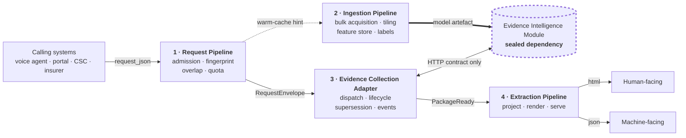

# Evidence Collection Platform

Four independently deployable programs built around the
[Evidence Intelligence Module](../evidence-intelligence-module/), which turns
satellite and weather observations into reproducible, legally admissible
technical evidence for crop-damage claims under PMFBY/RWBCIS.

The module does one thing and is finished: it takes a field geometry, an event
date and a peril type, and returns an evidence package. It deliberately does
not know who called it, where its training data came from, or what happens to
the package afterwards. Those three gaps, plus the seam between the module and
everything else, are what this platform fills.

---

## Why four programs

The module's constitution declares a set of permanent scope boundaries and a
§8 amendment procedure governing any change to them. Each program here occupies
one of those declared boundaries rather than crossing it.

| Program | Boundary it occupies | Constitution reference |
|---|---|---|
| **Request Pipeline** | No privileged caller; caller identity cannot live in the module | §5, §9.1 |
| **Ingestion Pipeline** | "Labeled data arrives" — nothing in the module produces it | §9.2 |
| **Evidence Collection Adapter** | The integration seam itself — lifecycle, retry, eventing | §5, §3 |
| **Extraction Pipeline** | Downstream consumption, dashboards, farmer-facing UI, delivery | §9.3 |

This is the organising principle of the whole platform. A capability that
belongs in one of these four is a capability the module was designed never to
grow, and adding it to the module would require amending a boundary rather than
writing code.

---

## Architecture

Programs 1, 3 and 4 sit on the request path. Program 2 runs entirely offline
and feeds Component 2 (the AI/ML damage model) through a file path the module
already reads from configuration.

---

## Documents

| # | Document | Covers | Read it when |
|---|---|---|---|
| 1 | [`01-request-pipeline.md`](01-request-pipeline.md) | Caller identity, request fingerprinting, duplicate and spatial/temporal overlap detection, quota metering | Integrating a new calling system, or investigating cost from redundant requests |
| 2 | [`02-ingestion-pipeline.md`](02-ingestion-pipeline.md) | Bulk scene acquisition, the offline feature store, label assembly, training and accuracy reporting for Component 2 | Planning to train the AI/ML model, or sourcing the 11 unsupplied features |
| 3 | [`03-evidence-collection-adapter.md`](03-evidence-collection-adapter.md) | Dispatch, polling, lifecycle state, package supersession, backpressure, the outbound event stream | Operating the platform, or deciding where a new cross-cutting concern belongs |
| 4 | [`04-extraction-pipeline.md`](04-extraction-pipeline.md) | Package projection, field mapping, null and disclosure rendering, HTML/JSON serving | Building a consumer integration, or adding a view over evidence |

### Reading paths

- **Integrating a caller** → 1, then 3 §4 for the envelope shape.
- **Consuming evidence downstream** → 4, then 3 §3.3 for supersession semantics.
- **Training the AI/ML model** → 2 in full; the label question in §2.1 gates everything else.
- **Operating or debugging** → 3 §7 and §3.2, then 1 §7.
- **Reviewing boundaries before adding a feature** → this file, then the target program's §1 and §2.

---

## Shared conventions

### Clause identifiers

Each program numbers its Phase 0 clauses with its own prefix — `RQP-P0-nn`,
`IGP-P0-nn`, `ECA-P0-nn`, `EXP-P0-nn`. Clauses are referenced by identifier
across documents and are stable; a clause is amended in place with its rationale
rather than renumbered.

### The swap test

Every program states four conditions under which it qualifies as pluggable, and
each is a test that can actually be run rather than a claim:

1. **Removal** — the platform still produces valid evidence with the program deleted.
2. **Replacement** — any process honouring the contract can substitute for it.
3. **Isolation** — no foreign key, no shared schema, no credential into another program's store.
4. **Independent release** — it ships without a coordinated deploy of the others.

Condition 3 is the one that is cheap to honour up front and expensive to unwind
later. No program holds a database credential for the evidence module, and none
holds a foreign key into another program's tables — downstream identifiers are
carried as opaque strings.

### Failure posture

The four programs fail in deliberately different directions, because they carry
different risks:

| Program | Posture | Rationale |
|---|---|---|
| 1 · Request Pipeline | **Open** | A cost-control layer must never become the reason a legitimate claim lacks proof. Overlap-lookup timeouts still admit. |
| 2 · Ingestion Pipeline | **Closed** | An unjustifiable model must never reach evidence. A corpus that cannot be justified produces no artefact. |
| 3 · Adapter | **Closed** | Dispatching without recording the dispatch produces requests nobody is tracking. |
| 4 · Extraction Pipeline | **Loud** | A rendering layer over legal evidence has one unacceptable behaviour: a plausible-looking document that is subtly wrong. |

### Derived constants

Analysis windows are read from the installed module rather than copied, so the
platform cannot drift from the science:

| Constant | Value | Source |
|---|---|---|
| `PRE_EVENT_WINDOW_DAYS` | 30 | `ingestion/imagery.py:17` |
| `POST_EVENT_WINDOW_DAYS` | 15 | `ingestion/imagery.py:18` |
| `HISTORICAL_BASELINE_YEARS` | 5 | `ingestion/imagery.py:19` |

Analysis window = `[event_date − 30d, event_date + 15d]`. Programs 1 and 2 both
depend on it, and both assert the values they read match the values above — that
assertion failing is the intended signal that the module has moved.

### Absence is never zero

`pipeline-decomposition-design.md` §1 in the module repo catalogues four defects
of a single shape: an input that was never measured being read as a measured
value. An absent post-event NDVI became `0.0` — a maximum-damage reading. Eleven
of seventeen model features became `0.0`, diluting every estimate toward zero.

The module fixed this internally by making absence a property of a type. Every
program here carries the same rule to its own boundary: Program 2 stores `None`
and omits the key rather than zero-filling; Program 4 renders "not measured" in
words rather than an empty cell that a reader will infer as zero.

---

## The sealed dependency rule

The evidence module is integrated, never extended. Concretely:

- No file inside `evidence-intelligence-module/` is added, edited, or deleted.
  A `git diff` against the vendored SHA runs in CI and must be empty.
- No program holds a database credential for the module's Postgres — not even
  read-only, not even for reporting. Everything the platform needs is in the
  published `GET` response.
- Communication is limited to `POST /evidence-requests`,
  `GET /evidence-requests/{request_id}`, object reads from the URIs those return,
  and the model artefact path in `AI_ML_MODEL_PATH`.

The reasoning is in [`03-evidence-collection-adapter.md`](03-evidence-collection-adapter.md) §1.1.
The short version: the moment a program SELECTs from `evidence_packages`, the
module's schema becomes a public interface and its migrations become breaking
changes for systems it has never heard of.

If the platform genuinely needs something the contract does not expose, the
correct move is a contract amendment in the module's own repo under its §8
process — not a shortcut around it.

---

## Ownership map

| Concern | Owner | Explicitly not |
|---|---|---|
| Caller identity, quota | Program 1 | The module (§5 forbids a privileged caller) |
| Training corpus, labels, model artefact | Program 2 | The module (§9.2) |
| Retry, eventing, queueing, lifecycle | Program 3 | The module (§3 — it never initiates) |
| Views, projections, per-consumer shapes | Program 4 | The module (§9.3) |
| Every figure that appears as evidence | The module | All four programs |
| Composite indices | The module, Component 5 (`dsi-entropy-v1`) | Program 4 |

The last two rows are the constraint that keeps the platform honest. No program
here computes a number that appears in an evidence package.

---

## Open decisions

Each is recorded where it bites, and none is resolved by guessing:

| Decision | Blocks | Where |
|---|---|---|
| AI/ML label source, including whether historical CCE outcomes may be used | Training Component 2 at all | 2 §2.1, §9 |
| Quota ceiling and enforcement | Phase 1 of Program 1 | 1 §2.1, §8 |
| Whether a cached package is valid evidence for an overlapping request | `REUSE_CANDIDATE` serving | 1 §3.3, §9 |
| Retention status of adapter package snapshots under IRDAI 2020 vs DPDP 2023 | Adapter storage design | 3 §9 |
| Whether an HTML view is a §65B electronic record | Whether renders are disposable | 4 §9 |
| When re-polling a preliminary package stops | Adapter poll bounds | 3 §9 |

Three of these mirror open issues already recorded in the module's own repo
under [`specs/001-evidence-generation-pipeline/issue/`](../evidence-intelligence-module/specs/001-evidence-generation-pipeline/issue/) —
the training-data source, the expected request volume, and the causation
confidence threshold. Phase 0 of the platform is partly designed to produce the
measurements that close them.

---

## Status

| Component | State |
|---|---|
| Evidence Intelligence Module | Implemented. 42 tasks complete, 55/55 tests passing, Postgres/PostGIS verified against a live database. Google Earth Engine not yet exercised against real credentials. AI/ML model ships untrained. |
| Programs 1–4 | Phase 0 designs. Clause sets, contracts, data models and failure postures defined; no implementation. |

Phase 0 across all four programs is uniformly **observe and disclose**. No
program blocks a request, rejects a caller, or suppresses a figure on a
threshold that has not been sourced. Thresholds ship unset and inert; supplying
one changes disclosure, not behaviour, until a Phase 1 decision says otherwise.
